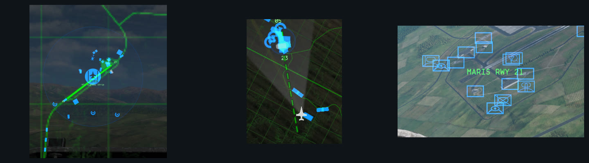
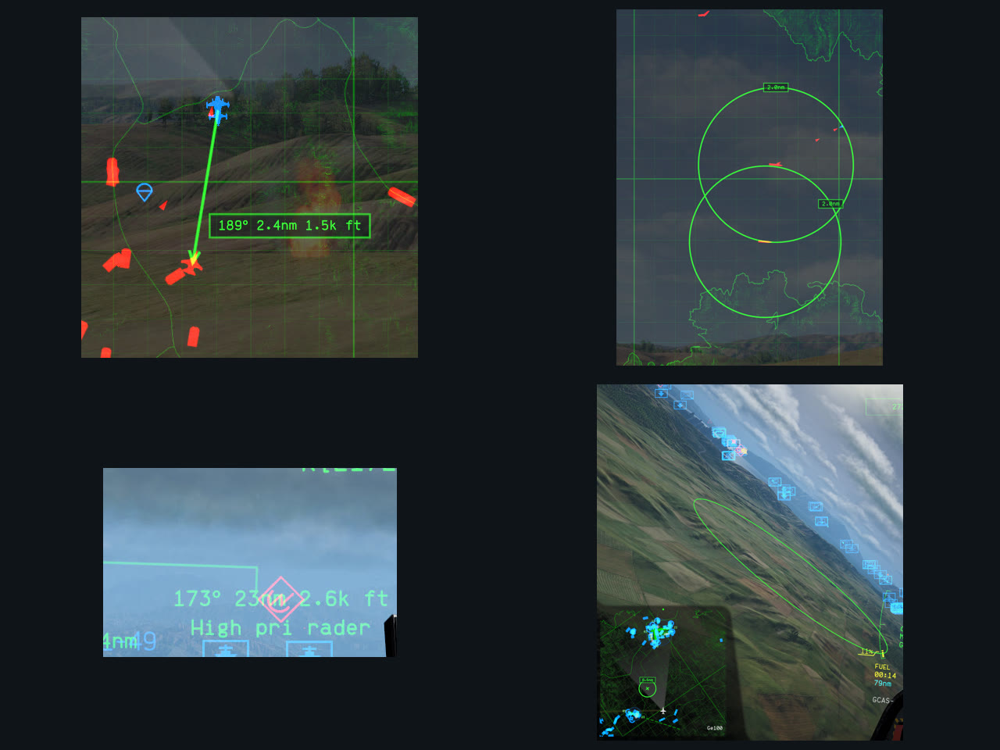

# NO Map Overhaul

My map mod for Nuclear Option: numbered runways with an approach line and a runway callout for ATC, planning tools on the full map, and airbase names.

**To install it, follow the [install guide](docs/INSTALL.md).** It isn't in the Nuclear Option Mod Manager catalog yet.

Up to 0.4.0 this mod was called Baanish UI Improvements. If you had it, delete `BepInEx/plugins/BaanishUiImprovements` when you install this; your settings carry over. Its missile arrows are now a mod of their own, [NO Missile Indicators](https://github.com/baanish/NO-Missile-Indicators).

It only draws on your screen. It doesn't patch the game and sends nothing over the network, so nobody else sees what it draws. I've tested it in single-player missions, and version 0.4.0 in a multiplayer session. The map tools haven't been flown in multiplayer yet. To turn everything off without uninstalling, switch off **General → Enabled** in the settings.

## Runway markers

- **Runways on the map.** Each friendly runway is a green strip with a thin dark rim, so it stays readable over the map's own bright linework. Its number sits past each end, so the west end of an east-west runway reads 09 and the east end 27. The numbers come from the runway heading, the same way the game numbers its landing clearance, except where the paint on the tarmac says otherwise.
- **Approach line.** Within 5 km, a dashed 5 km centerline extends off the nearest end of the nearest runway, so you can judge the turn onto final. Each dash plus its gap is 500 m, so the dashes double as distance ticks.
- **HUD callout.** The same runway end gets a `RWY 27` label pinned over its threshold in the 3D view, ready for an ATC call. An optional prefix adds the airbase (`NBSCLI RWY 27`), and another option hides the label until your gear is down.
- **Airbase boundary**, off by default. A faint shaded circle in the game's friendly map colour marks each friendly airbase's landing zone. Stop inside it after landing and the sortie ends as returned instead of crashed.

It doesn't guess which way you'll land: it always shows the end you're closest to. Helicopters get the airbase boundary but no runways (the Tarantula tiltrotor lands on runways, so it counts as a plane), and carriers are left out because the ship's own icon already marks the deck.

## Map tools

On the full map, click **Tools** or press `H` to open a rail of planning tools beside the map. The number keys pick a tool:

1. **Bearing/range** draws an arrow labelled with its bearing and range. End it on a contact and the label adds the contact's altitude, like a BRA call, and follows it.
2. **Circle** draws a range ring, which also shows as a ring in the 3D view.
3. **Text** places a note. Put it on a contact to tag it, and the tag follows the contact.
4. **Pen** draws freehand lines.
5. **Waypoint** builds a numbered route, with the next two waypoints labelled in the 3D view.
6. **Eraser** deletes a drawing.

Only you see what you draw, and it clears when you leave the mission. Drawings on other units use only what your side knows: when your side loses a contact, its drawings stop where it was last seen and read `lost`.

The tools work alongside [NOAutopilot](https://github.com/qwerty1423/no-autopilot-mod). Its right-click waypoints work as usual while the rail is closed. While the rail is open, the mod holds them back, so a right click that deletes a drawing doesn't also move your autopilot route. That hold is the mod's one patch, and it's on NOAutopilot, not on the game.

See the [map tools guide](docs/MAP_TOOLS.md) for every tool, the keys, and planning ideas.

## Airbase names

Off by default. Your side's airbases get a faint name label on the full map, so you can find the one someone just called out. That includes airbases a mission adds and ones your side captures. Enemy and neutral airbases get no name, since the game doesn't mark them.

## Coming soon

Planned for 0.6.0, not built yet:

- **Shared drawings in multiplayer, by channel.** List the channels you follow in settings, comma-separated, up to 10. A channel can be a squadron, so your drawings reach the people who need them and nobody else.
- **Picking a channel.** New drawings go to your first channel. `Shift+1` to `Shift+9` pick channels 1 to 9 for your next drawings, and `Shift+0` picks channel 10, so a Medusa crew can work out BRA calls in their own channel without cluttering everyone else's map.

## Requirements

- Nuclear Option 0.34.2.
- BepInEx 5, tested with 5.4.23.4.
- Optional: [BepInEx Configuration Manager](https://github.com/BepInEx/BepInEx.ConfigurationManager) to change settings in game with F1.

## Install

Download `NoMapOverhaul-v<version>-plugin-only.zip` from [releases](https://github.com/baanish/NO-Map-Overhaul/releases) and follow the [install guide](docs/INSTALL.md). It covers BepInEx, checking the mod loaded, upgrading from Baanish UI Improvements, updating, and uninstalling.

The [user guide](docs/USER_GUIDE.md) covers every setting, how the runway end is chosen, the airbase abbreviations, and how to measure the mod's cost on your machine.

## Contributing

Bug reports and ideas are welcome. Include your game and mod versions, a screenshot, and what you expected to see. See [contributing](CONTRIBUTING.md) to build it yourself.

## License

[MIT](LICENSE). The waypoint reach rule is adapted from NOAutopilot, also MIT; see [third-party notices](THIRD_PARTY_NOTICES.md). Nuclear Option and its assets belong to their respective owners.
