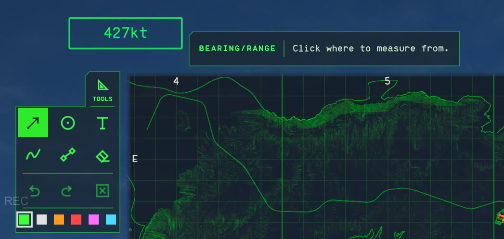
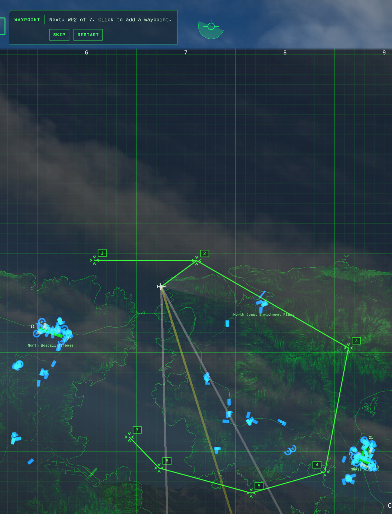
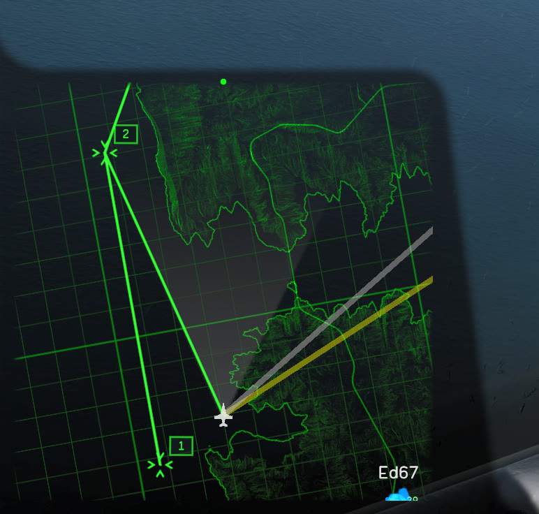
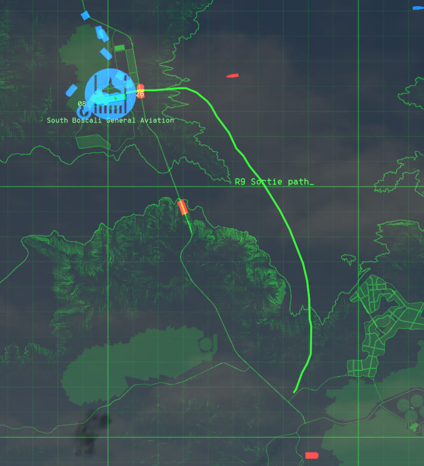
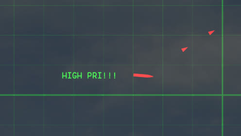
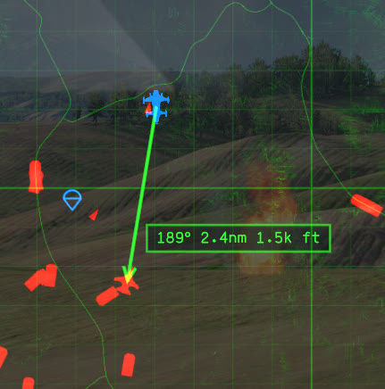
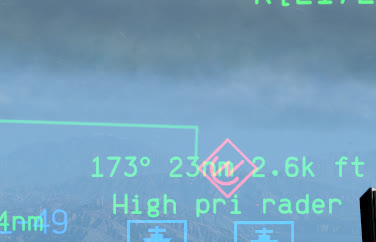
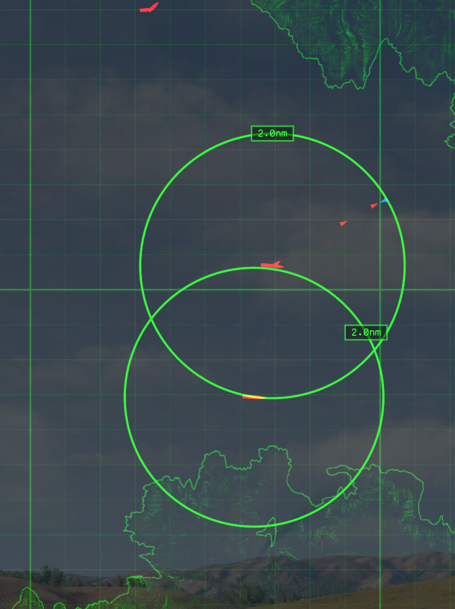
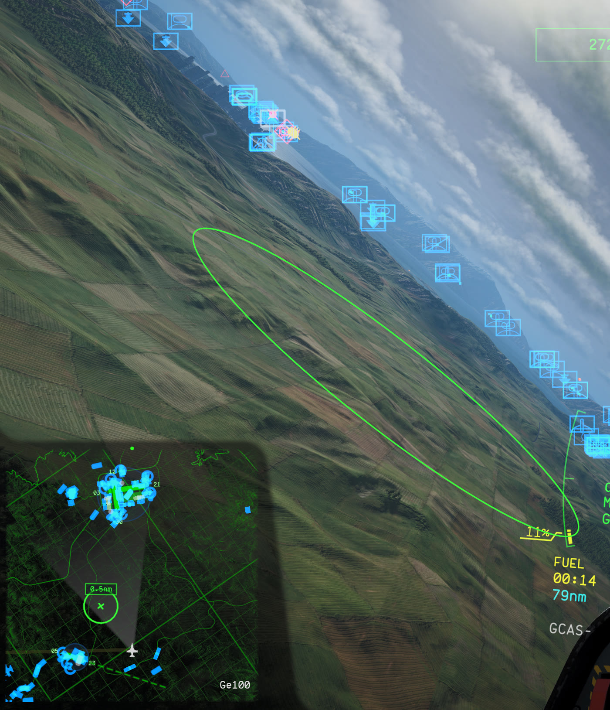

# Map tools

The map tools let you plan on the full map: bearing and range measurements, range circles, text notes and contact tags, freehand lines, and a waypoint route with markers in the 3D view. Only you see what you draw, and it all clears when you leave the mission.

Every setting mentioned here is listed in the [user guide's settings table](USER_GUIDE.md#settings), in the **Map Tools** sections. The limits are advanced settings, which F1 shows with **Advanced settings** ticked.

## Quick start

1. Open the full map.
2. Click **Tools** just outside the map's top-left corner, or press `H`. A green rail of tool icons opens left of the map, with Bearing/range picked the first time, and the tool you last picked after that.
3. Press `5` for Waypoint, then click the map to drop waypoints. A numbered route appears, and a line runs from your aircraft to the next waypoint.
4. Close the map. The next two waypoints show in the 3D view with their distance and bearing, such as `WP2 4.2nm 045°`.
5. Open the map again. The rail closed with the map, so your clicks go to the game until you press `H` or click **Tools**.

## Mouse and keys

These work on the full map. The mouse works while the rail is open. The keys work with the rail open or closed.

| Do this | To |
| --- | --- |
| Left click or drag | Use the picked tool. |
| Right click while drawing | Cancel what you're halfway through. |
| Right click a drawing | Delete it. Undo brings it back. |
| `H` | Open or close the rail, like clicking **Tools**. |
| `1` to `6` | Pick Bearing/range, Circle, Text, Pen, Waypoint, or Eraser, in rail order. With the rail closed, this opens it on that tool. |
| `1` twice, quickly | Pick Bearing/range and measure from your aircraft: your next click sets the other end. |
| `Z` | Undo. |
| `Y` | Redo. |
| Drag on empty map | Pan the map, except with Pen and Circle, which draw by dragging. |

The keys don't act while you type a note, chat, or type in one of the game's text boxes, while the game menu is open, or with Shift or Ctrl held. Change them with **Tools key**, **Undo key**, **Redo key**, and the advanced **Bearing/range key** to **Eraser key**.

A selected friendly unit keeps its right click: with one selected, right click gives it a move order as usual, and the tools leave that click alone.

## The rail

The rail stands left of the map, in rows of icons read left to right. It has an icon for each tool, in the order of their keys, `1` to `6`: Bearing/range, Circle, Text, Pen, Waypoint, and Eraser. Clicking **Tools** opens it on the tool you last picked, Bearing/range the first time after starting the game, and closing the map closes it. The picked tool is solid green. Hover over an icon to see its name and key. Below the tools are Undo, Redo, and Clear, and then six colour swatches: green, white, orange, red, magenta, and cyan. The swatch you pick colours everything you draw next.

The strip above the map, between the speed readout and the attitude ball or mission clock, names the picked tool and says what your next click does. It also holds that tool's buttons, such as **Skip** and **Restart** for a route, or the preset circle sizes. When something can't be done, such as when a limit is reached, the strip turns amber and says why.

When the screen leaves no room outside the map, the rail or the strip moves inside the map's top-left corner instead. The rail moves in on a screen about as tall as it is wide, and stands as a single column. The strip moves in when the map sits too near the top of the screen, and runs beside the **Tools** button.

## Waypoint

Click the map to add a waypoint to the end of your route. Waypoints are numbered in order and joined by one line. Click on or beside a unit's icon to put the waypoint on that unit, and it moves with the unit.

While you fly, a line runs from your aircraft to the next waypoint. A waypoint counts as reached when you fly within 2.5 km of it, or when you pass it with it still within 10 km behind you. The route then moves on to the next one. Taxiing doesn't count.

- **Skip** moves on to the following waypoint without flying the next one.
- **Restart** goes back to waypoint 1. A waypoint already behind you then waits until you've turned toward it.
- **Undo** takes back the last waypoint. The Eraser deletes the whole route.

The next two waypoints show in the 3D view with their distance and bearing from you. A waypoint on a unit that's destroyed, or no longer tracked by your side, reads `lost` and stays where the unit was last seen. A route holds up to 99 waypoints.

With NOAutopilot installed, both routes work side by side. Plan the autopilot's route with right clicks while the tools rail is closed. The rail holds NOAutopilot's right clicks back while it's open, so a right click to delete a drawing doesn't also drop an autopilot waypoint.

## Pen

Press and drag to draw a line. The map doesn't pan while you draw. A click without dragging leaves a dot.

Pen lines share a budget of points, set by **Most pen points**. A line that uses up the budget stops where it is, and the strip turns amber. Erase or undo a line to draw more.

## Text

Click where the note should go, type it, and press Enter. Escape drops it. Clicking somewhere else places what you've typed and starts a new note there.

Click on or beside a unit's icon to put the note on that unit, such as `BOMBERS` on a contact. The note sits beside the unit's icon and follows the unit, and in the 3D view it shows on the unit at its altitude. When your side loses track of the unit, the note stops where the unit was last known and reads `lost`, and it follows again once the unit is spotted. When the unit is destroyed, its note goes with its map icon, and Undo can't bring it back.

While you type, your keys go to the note, not to the aircraft. Close the chat box before you place a note, since both read the same keys. A note is one line of up to 64 characters, and it also shows in the 3D view: on its unit, or on the ground at that spot.

## Bearing and range

Click where to measure from, then where to. An arrow joins the two points, and the label at its head reads the bearing in degrees true and the distance, such as `045° 4.2nm`. Before your second click, the arrow follows the cursor, so you can read a measurement without placing it.

Click on or beside a unit's icon to tie that end to the unit. The arrow and its numbers then follow the unit as the map updates. Tie one end to your own aircraft and the other to a target, and the label is always your bearing and range to it. The label also shows in the 3D view.

To measure from yourself without finding your own icon, such as over a crowded airbase, press `1` twice within about a third of a second. That picks Bearing/range and ties the start to your aircraft, replacing a start you'd already placed, so your next click sets the other end. While you're dead or spectating, the strip says there's no aircraft to measure from.

When the arrow ends on a unit, the label adds that unit's altitude above sea level, like a BRA call: `045° 12nm 18k ft` in miles, or `045° 22km 5500 m` in kilometres. Feet show in thousands, to the nearest 100 ft below 10,000 ft (`4.5k ft`) and the nearest 1,000 ft above; metres show to the nearest 100 m. An arrow ending on a spot on the map shows no altitude.

The range is the straight line between the two ends, through the air: a unit's end is at its altitude, and a spot on the map is on the ground. So a target straight above you reads its height as range. The bearing is still measured across the map. Circles and waypoint distances measure across the ground.

## Circle

Press on the centre and drag out to the radius, or click the centre and then the edge. The radius is written on the ring.

For a set size, pick **5**, **10**, or **20** in the strip, then click the centre. The sizes are in your distance unit. Put the centre on a unit and the circle follows it.

Each circle also shows in the 3D view as a thin ring, level with its centre: at the unit's altitude, or on the ground. Turn this off with **Circles in 3D view**. The 3D view shows the 16 newest circles.

## Eraser, undo, and clear

With the Eraser, the drawing under the cursor turns red, and a click deletes it. A right click deletes a drawing with any tool picked. **Clear** deletes everything at once, as one step, so Undo brings it all back.

## Planning ideas

- **Stay out of a SAM's reach.** Put a circle on the SAM's icon, sized to its range. Its ring then shows in the 3D view, so you can see the edge of the threat from the cockpit.
- **Time on target from two sides.** Each pilot puts a circle of the same size around the target and picks an entry point on it, on opposite sides. Measure from each entry point to the target, and call "in" together so both arrive at once. Drawings aren't shared, so each pilot draws their own.
- **Keep a target's bearing handy.** Measure from your aircraft to a moving target, with both ends on units. The label keeps updating as you both move, while your side tracks the target.
- **Brief a route.** Drop waypoints over the ingress, add notes such as `IP` or `EGRESS`, and fly it with the 3D labels.
- **Tag contacts for a flight.** As ATC or AWACS, put notes such as `BOMBERS` or `CAP 2` on contacts' icons. Each tag follows its contact, reads `lost` when your side loses it, and goes when it's destroyed, so the picture you call out stays current. Drawings aren't shared, so the tags are for your own calls.

## What drawings know

Drawings only use what your side knows. A drawing on a unit follows it only where the game shows that unit to you, at the altitude your side knows, and you can only tie a drawing to a unit whose icon is on your map. When nothing on your side has spotted the unit for 4 seconds, or it's destroyed, the unit is lost: the drawing stops where the unit was last known, its label reads `lost`, and its bearing and range stop changing except as you move. If your side spots the unit again, the drawing follows it again. A note on a unit goes when the unit is destroyed, at the moment the game takes the unit's icon off your map.

## Where drawings show

Drawings show on the full map and on the minimap. Turn off **Show on minimap** to keep the minimap clear. They sit under the game's unit icons, so they never hide a unit.

In the 3D view, a measurement's label shows at the arrowhead, a note shows on its unit or on the ground at its spot, the next two waypoints show with their distance and bearing, and each circle shows as a ring. They hide with the HUD and while the map is open. Labels on one point, such as a measurement and a note on the same contact, stack downward from it with the measurement on top.

Measurements, radii, and waypoint numbers sit on small dark plates. On the full map, they move aside so they don't cover unit icons, airbase names, runway numbers, or each other. On the minimap, they move aside so they don't cover each other.

Distances follow the game's unit setting: kilometres for metric, nautical miles for imperial. Set **Distance units** to always use one unit. Altitudes go with it: metres beside kilometres, feet beside miles.

## Keeping it fast

A few drawings cost almost nothing, and a map full of them costs frames. Two limits keep that in check. **Most drawings** caps the number of drawings, 200 by default, and **Most pen points** caps pen detail.

To measure the cost on your own machine, run the perf test described in the [user guide](USER_GUIDE.md#the-perf-test).
